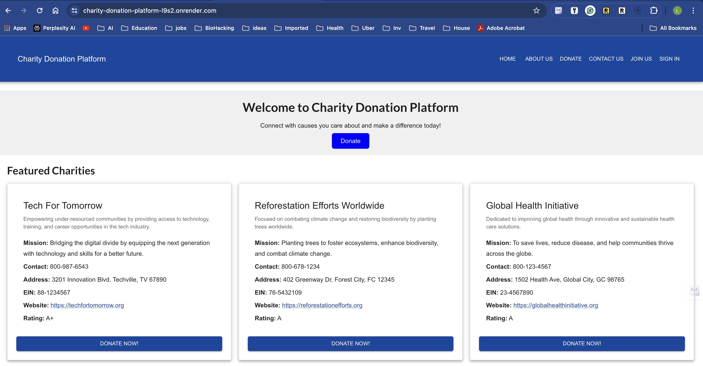

# Charity Donation Platform

Welcome to the GitHub repository for the Charity Donation Platform, a single-page application that connects charities with potential donors. This application is designed to streamline the process of making impactful donations to a variety of causes, ensuring transparency and ease of access for both donors and charities.

## Features

- **Charity Profiles:** Detailed profiles for each charity, including mission statements, impact scores, and direct donation capabilities.
- **Donation Processing:** Integrated with Stripe for secure and hassle-free donation processing.
- **Event Listings:** Up-to-date information about charity events and opportunities to engage.
- **Donor Accounts:** Donors can create accounts to track their donation history and manage their profiles.
- **Responsive Design:** Fully responsive interface that works on mobile, tablets, and desktop.

## Technologies Used

- **Frontend:** React
- **Backend:** Node.js, Express.js
- **Database:** MongoDB with Mongoose ODM
- **API:** GraphQL
- **Authentication:** JWT for user authentication
- **Styling:** Material-UI, Emotion (CSS-in-JS)
- **Payment Processing:** Stripe

## Getting Started

To run this project locally, follow these steps:

### Prerequisites

- Node.js
- npm or Yarn
- MongoDB
- Stripe account for payment processing setup

### Installation

1. Clone the repository:

```bash
git clone https://github.com/maslla100/Charity-Donation-Platform
cd Charity-Donation-Platform
```

2. Install dependencies for server and client:

```bash
# Install server dependencies
cd server
npm install

# Install client dependencies
cd ../client
npm install
```

3. Set up environment variables:

- Create `.env` files in both the `server` and `client` directories.
- In `server/.env`, specify your MongoDB URI, JWT secret, and Stripe secret key.
- In `client/.env`, include your React app's environment variables, such as the API URL and Stripe public key.

Example for `server/.env`:

```plaintext
JWT_SECRET=your_jwt_secret
MONGODB_URI=your_mongodb_uri
STRIPE_SECRET_KEY=your_stripe_secret_key
```

Example for `client/.env`:

```plaintext
REACT_APP_API_URL=http://localhost:4000/graphql
REACT_APP_STRIPE_KEY=your_stripe_public_key
```

4. Run the application:

```bash
# Start the server
cd server
npm start

# Start the client
cd ../client
npm start
```

Your app should now be running on <http://localhost:3000>.


## Deployment

This app is set up for deployment using Render. Follow the instructions provided in the Render documentation to deploy your MERN stack application.

## Contributing

Contributions are what make the open-source community such a fantastic place to learn, inspire, and create. Any contributions you make are **greatly appreciated**.

1. Fork the Project
2. Create your Feature Branch (`git checkout -b feature/AmazingFeature`)
3. Commit your Changes (`git commit -m 'Add some AmazingFeature'`)
4. Push to the Branch (`git push origin feature/AmazingFeature`)
5. Open a Pull Request

## License

Distributed under the MIT License. See `LICENSE` for more information.

## Contact

luis.llamas@maslla.com

Project Link: [https://github.com/maslla100/Charity-Donation-Platform](https://github.com/maslla100/Charity-Donation-Platform)

Live URL will be up for two to three weeks after last commit is made.  https://charity-donation-platform-l9s2.onrender.com/


The following image shows the web application's appearance and functionality:

